# Hybrid Email Spam Detection System

An explainable email spam detection system that combines advanced data structures, graph-based relationship analysis, and machine learning concepts to classify emails as spam or legitimate. The project also provides step-by-step visual analysis to show how each email is processed.

---
---

## Screenshots

### Front Page
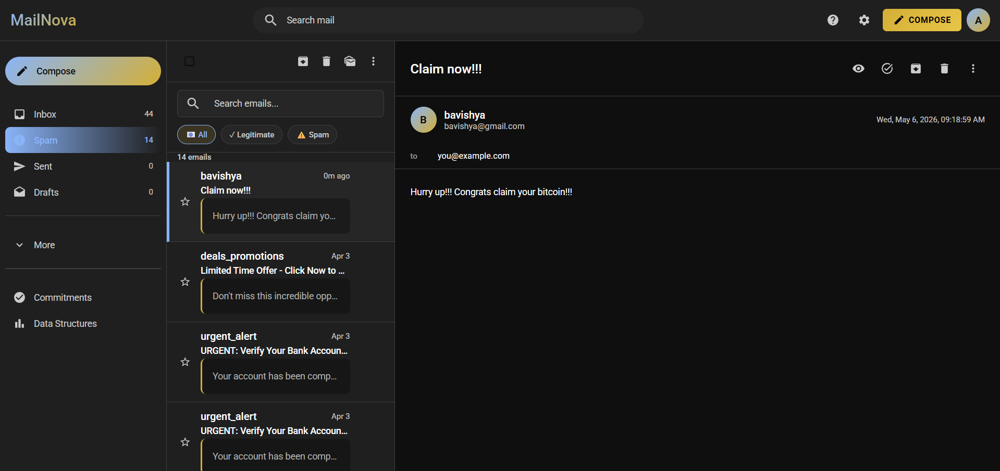

### Inbox
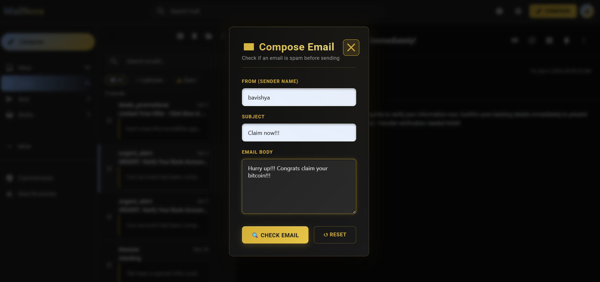

### DAG Information
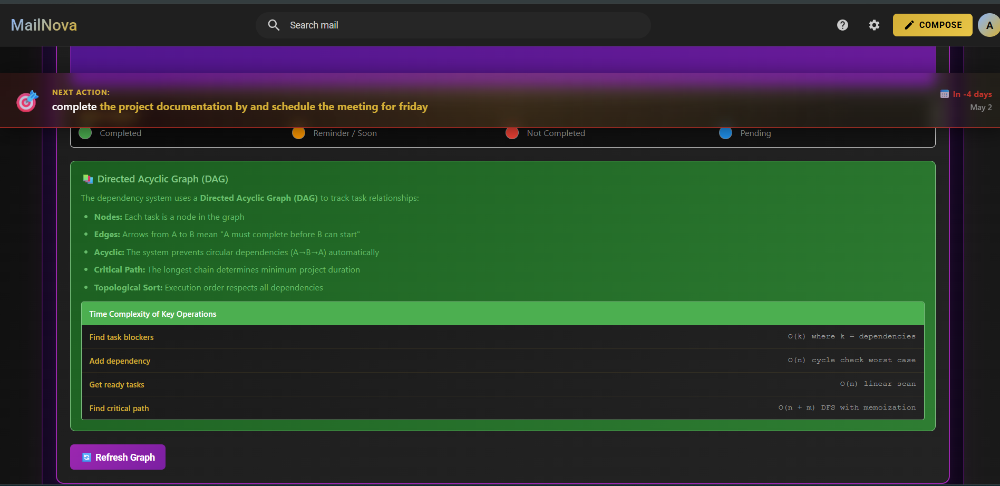

### DAG Analysis
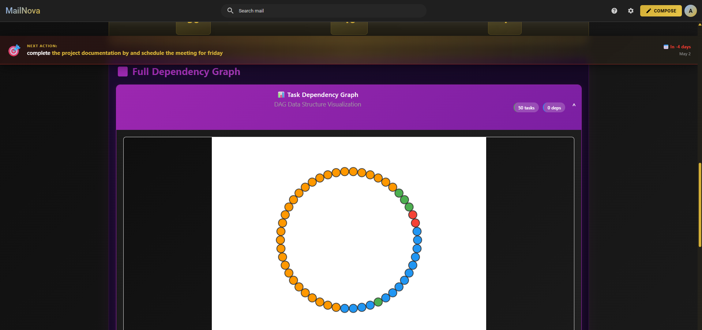

### Parsing
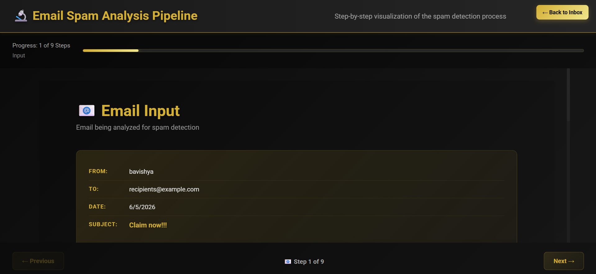

### Preprocessing
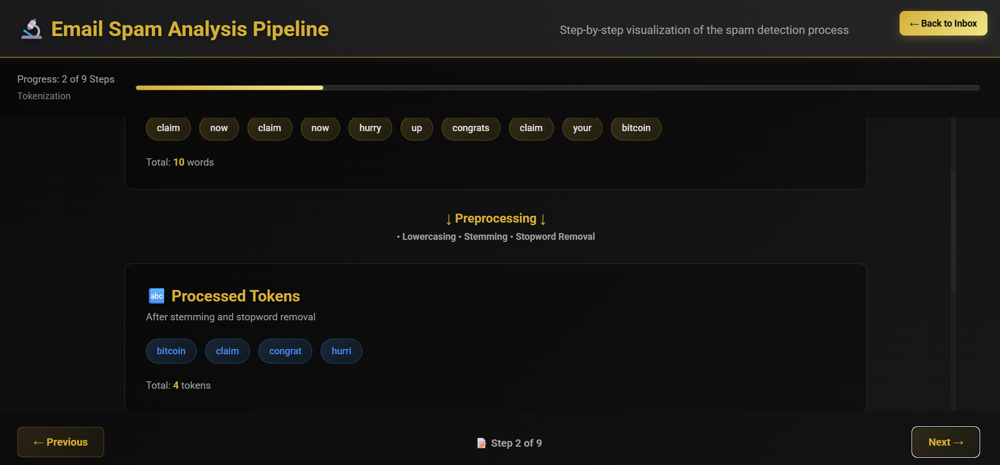

### Bloom Filter
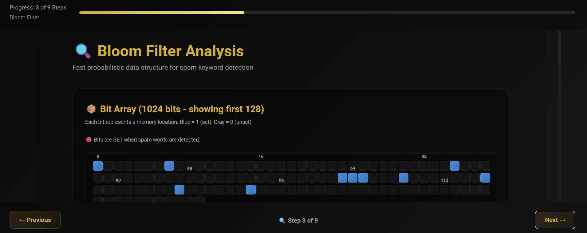

### Hash Table
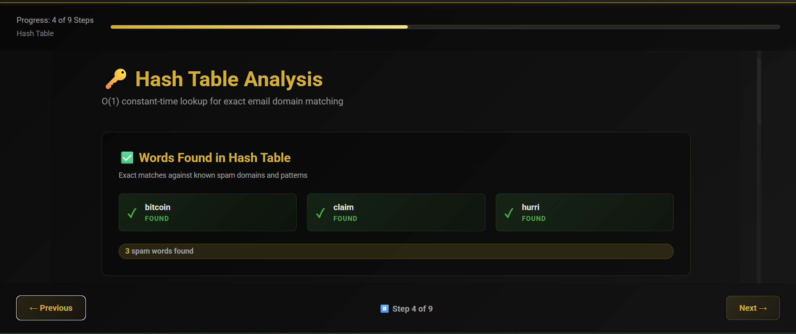

### AVL Tree
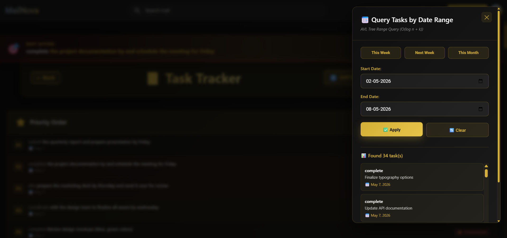

### Priority
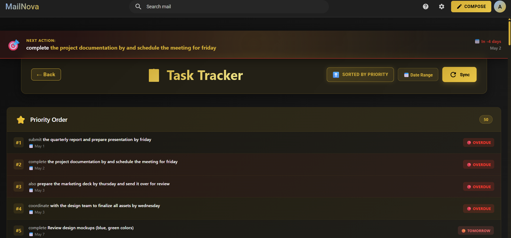

### Tracking
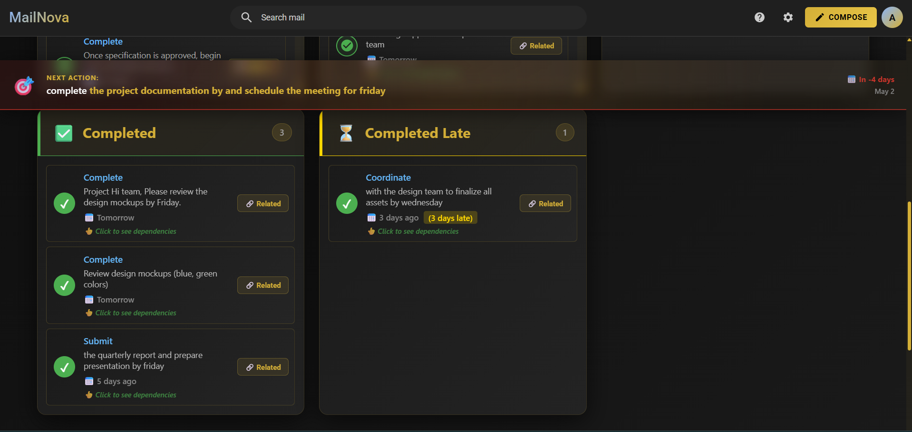

### Task Tracker
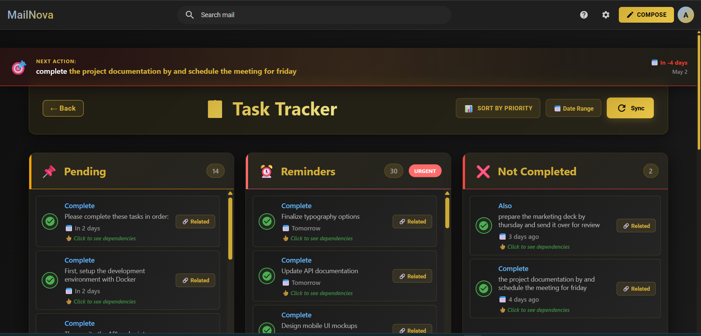

### Spam Score
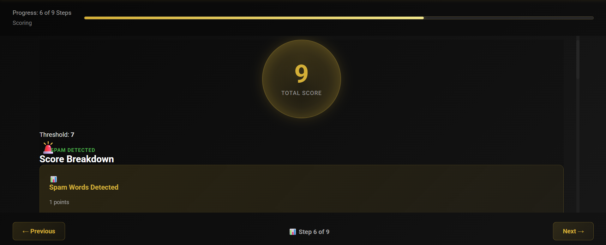

### ML Analysis
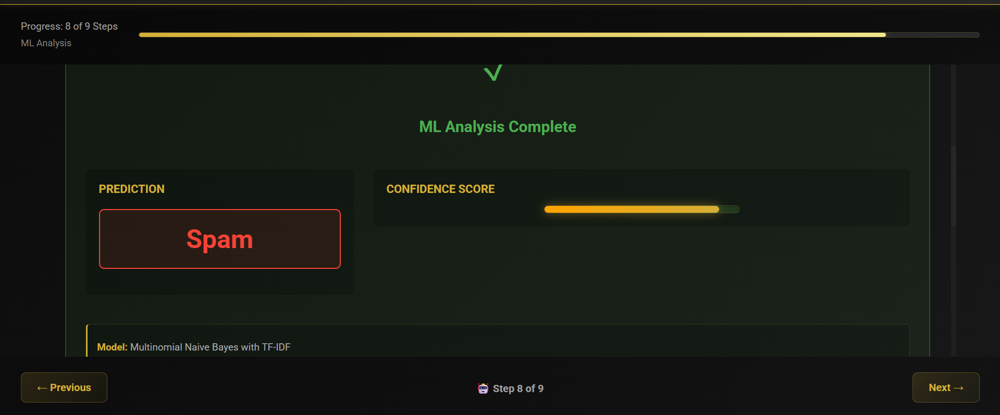

## Project Overview

This project is designed to detect spam emails using a hybrid approach. Instead of only showing the final result, the system explains how the decision is made through multiple stages such as preprocessing, Bloom Filter checking, hash table lookup, graph analysis, scoring, and ML analysis.

The main goal of this project is to make spam detection fast, memory-efficient, and explainable.

---

## Features

- Gmail-like email user interface
- Compose email and classify it as spam or legitimate
- Bloom Filter based spam keyword detection
- Hash Table lookup for exact spam word matching
- Trie-based pattern detection
- Graph/DAG-based relationship analysis
- Spam score calculation
- ML analysis section
- Priority and tracking modules
- Interactive visual explanation of each processing stage
- Screenshots included for project demonstration

---

## Technologies Used

- JavaScript
- React.js
- Node.js
- CSS
- Bloom Filter
- Hash Table
- Trie
- Graph / DAG
- Machine Learning concept integration
- GitHub for version control

---

## System Workflow

```text
Email Input
   ↓
Parsing
   ↓
Preprocessing
   ↓
Bloom Filter Check
   ↓
Hash Table Lookup
   ↓
Graph / DAG Analysis
   ↓
Spam Score Calculation
   ↓
ML Analysis
   ↓
Final Classification
